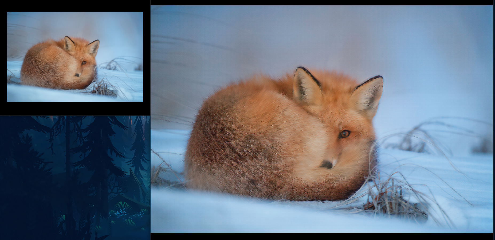

# reimplementationESRGAN-pytorch

reference paper: https://arxiv.org/abs/1609.04802

I use a different hyperparameters:

```
LEARNING_RATE = 1e-4
START_EPOCHS = 1
NUM_EPOCHS = 100
BATCH_SIZE = 4
NUM_WORKERS = 4
HIGH_RES = 256
LOW_RES = HIGH_RES // 4
IMG_CHANNELS = 3
#For the generative loss function I'm using this formula
gen_loss = 6e-2 * loss_for_vgg + 1e-2 * adversarial_loss + 0.92*l2_loss

```

## Weights:

https://drive.google.com/drive/folders/1IC-D0jgfz51RrzLuG0bWaGSfImOJNYYL?usp=sharing

## Result

#### Low Resolution Image


#### High Resolution result


#### Comparison



## License

for the code it's MIT license but for the weight it's not for commercial just research purpose only because I train on DIV2K datasets

## References

1. https://arxiv.org/abs/1609.04802
2. https://github.com/aladdinpersson/Machine-Learning-Collection/tree/master/ML/Pytorch/GANs/SRGAN
