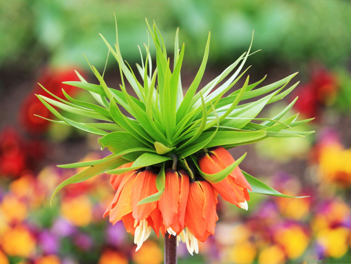

# Binary Compression
it can compress your image until 2 times smaller, you can add this with other compression method to achieve 2 times better result just like SRGAN you can achieve not just n^2 smaller but 2*n^2 smaller

## Method
1. convert 8 bit pixel image to 4 bit pixel image
2. split the image into top and bottom
3. combine the top image and bottom image to achieve 8 bit image combined
4. your image is compressed

example:
```bash
0101111 -> 0101
1111111 -> 1111
etc
```

## Result
PSNR: 29.12790924842205
### Original Image

### Compressed Image

### Decompressed Image
