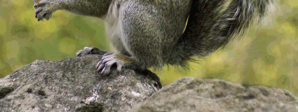

# Image Compression Shrink Binary Compression with SRGAN Recovery
it is result of combining two method
1. https://github.com/rubythalib33/image-compression-folder/tree/main/01_image_compression_srgan
2. https://github.com/rubythalib33/image-compression-folder/tree/main/02_binary_compression

## Source Image
### Size: 4,3 MB

### Size: 5,4 MB 

## Compressed
### Size: 100,9 kB

### Size: 130,6 kB

## Recovered

